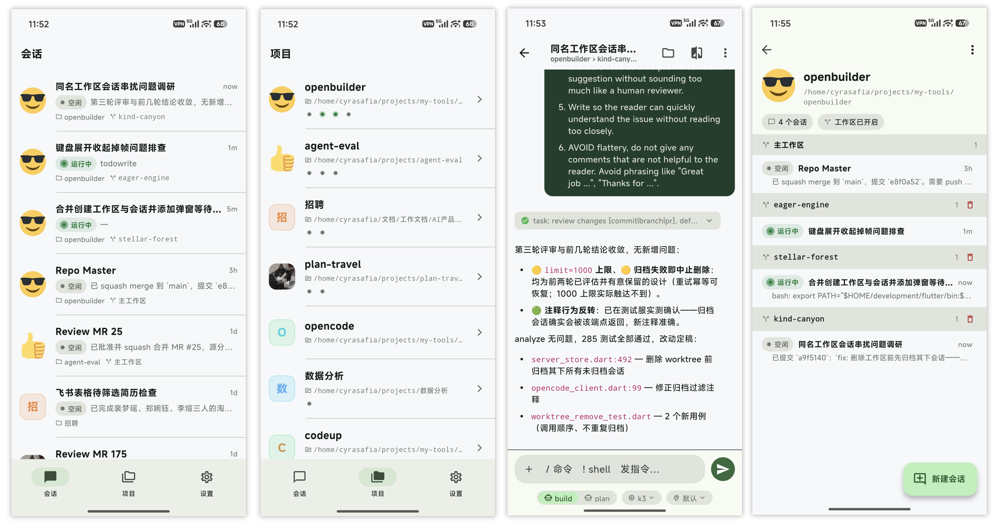
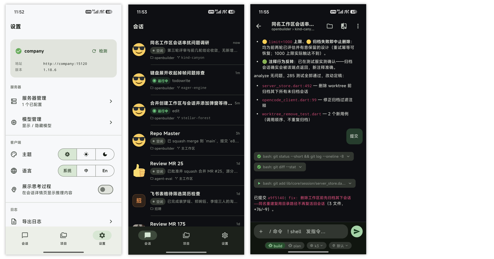
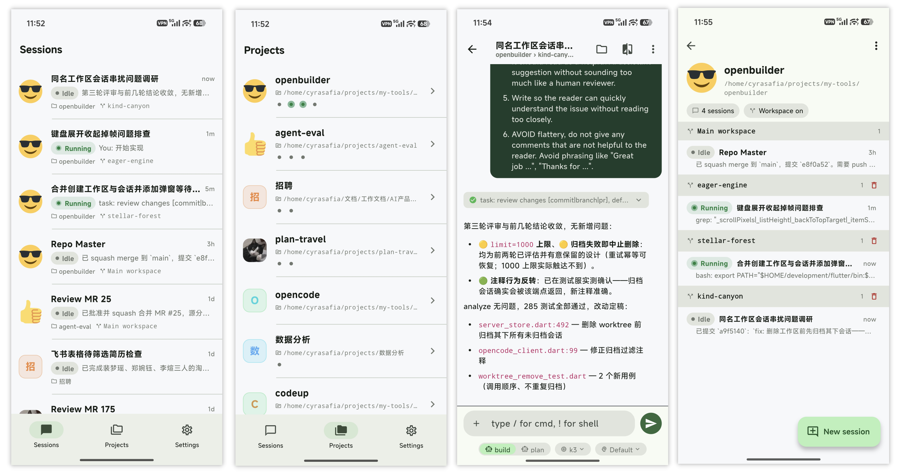
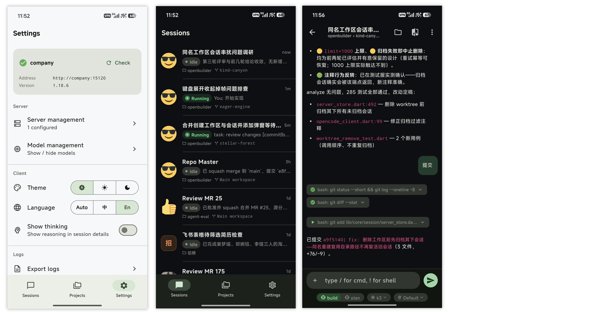

# openBuilder

> 面向所有 builder（而非仅 coder）的开源友好 AI Agent 手机客户端。
> An open-source-friendly mobile client for **all builders** (not just coders) — your AI agent, in your pocket.

[English](#english) · [中文](#中文)

---

## 中文

### 项目目标

openBuilder 的目标是创造一个**面向所有 builder（而非仅 coder）** 的开源友好的 AI Agent 手机客户端。

我们希望把 AI Agent 的能力从桌面带到手机：无论是写代码、整理资料、跑自动化任务，还是查看 Agent 的工作进度，你都可以在手机上随时随地进行，而不必绑定到某一家闭源的商业服务。

当前版本仅对接 **opencode** 这一开源个人 Agent；未来会逐步接入更多优秀的开源个人 Agent，让同一个客户端成为你与各类 Agent 协作的统一入口。

### 功能简介





openBuilder 是 opencode 远程服务器的**瘦客户端**（以只读 + 轻交互为主），通过局域网 mDNS / Tailscale 连接你自己的 opencode 服务。主要功能包括：

- **会话管理**：跨项目/工作区的全局会话列表，实时查看 Agent 的状态（idle / busy / retry）与消息流。
- **流式对话**：基于 SSE 实时接收 Agent 回复，支持打字机式流式渲染、任务进度（todo）与权限卡片。
- **项目与 Worktree**：浏览项目（仓库）、按 git worktree 分段查看会话，支持并行任务的工作区切换。
- **Diff 查看**：只读查看 Agent 改动的代码 diff，行级增删高亮，按文件切换。
- **文件浏览**：查看文件树与文件内容、搜索文件与符号。
- **下指令**：在会话中发送消息、斜杠命令与 shell 指令。
- **连接与鉴权**：自动通过 mDNS 发现局域网内的 opencode 服务，也支持手动填写 Tailscale / IP 连接；添加服务器时自动探测鉴权方式（OAuth / Basic / 无鉴权），连接配置与令牌安全存储于本地。
- **设置**：服务端状态、服务器管理、主题（Material 3 深浅色跟随系统）。

平台：Android + iOS（Flutter 单代码库）。

### 鉴权方式

添加服务器时，openBuilder 会自动探测服务端支持的鉴权方式，并按 **OAuth → Basic → 无鉴权** 的优先级分流：

| 方式 | 适用场景 | 说明 |
|---|---|---|
| **OAuth**（推荐） | **公网**部署，或置于鉴权网关之后 | 标准 OIDC `authorization_code` + PKCE (S256) + PAR + loopback 回调，在应用内 WebView 中完成登录与授权；令牌自动刷新、过期后可重登。服务端需按下方「推荐网关」配置 |
| **Basic** | 内网 / Tailscale 直连 | opencode 原生鉴权（`OPENCODE_SERVER_PASSWORD`），用户名默认 `opencode` |
| **无鉴权** | 本地 / 受信内网 | 未设密码的 opencode，探测通过后直连 |

> ⚠️ Basic 与无鉴权仅建议用于内网 / Tailscale。opencode 自身的鉴权不是为公网暴露设计的——公网请使用 OAuth（网关鉴权）。

### 推荐服务端（公网鉴权网关）：Authelia

公网场景推荐在 opencode 之前部署 [Authelia](https://www.authelia.com/)（开源、单组件，同时充当 OIDC 提供方与 forward-auth 鉴权网关）：

```
openBuilder ──①OAuth 登录（应用内 WebView）──> Authelia
openBuilder ──②Bearer token──> 反向代理(Caddy/nginx) ──forward-auth──> Authelia 校验 ──> opencode（内网）
```

**对 Authelia 配置的要求**（客户端对接的前提）：

1. 启用 OIDC provider，并注册一个**公共客户端**（public client，无 secret），满足 Authelia 对 Bearer 授权客户端的硬性限制：
   - `grant_types`: `authorization_code` + `refresh_token`
   - `require_pkce: true` + `pkce_challenge_method: S256`
   - `require_pushed_authorization_requests: true`（强制 PAR）
   - `response_modes: form_post`（或允许 loopback 回调的 query 模式）
   - `scopes`: `offline_access` + `authelia.bearer.authz`
   - `audience`: 你的 opencode 公网地址（如 `https://oc.example.com`）
   - `redirect_uris`: 精确匹配 `http://127.0.0.1:8901/callback`（openBuilder 固定监听此回环地址）
2. forward-auth 鉴权端点开启 Bearer scheme（`HeaderAuthorization` 策略的 `schemes` 含 `Bearer`）。
3. `access_control` 规则放行授权用户访问 opencode 域名（支持 2FA）。

完整配置样例与已实测的端到端流程见 [docs/todo-authelia-bearer-authz.md](docs/todo-authelia-bearer-authz.md)，客户端协议细节见 [docs/design-oauth-login.md](docs/design-oauth-login.md)。

> 也兼容其他标准 OIDC 提供方（Keycloak、Authentik、Zitadel 等）：只要支持 PKCE + loopback 重定向并在网关层校验 Bearer token 即可接入；Authelia 是当前文档化、经过完整实测的推荐方案。

### 使用方法（构建）

#### 环境要求

- [Flutter](https://docs.flutter.dev/) **3.44.x**（本项目 Dart SDK 约束为 `^3.12.2`；CI 使用 `3.44.6`）
- 一台已运行 `opencode serve` 的远程服务器（通过局域网或 Tailscale 可达）

#### 安装依赖与运行

```bash
# 拉取依赖
flutter pub get

# 启动调试应用（连接真机 / 模拟器 / 桌面）
flutter run
```

首次启动会进入欢迎页，按提示「添加服务器」——输入名称与地址后，openBuilder 会自动探测鉴权方式（OAuth / Basic / 无鉴权）并分流到对应登录流程；也可通过 mDNS 自动发现局域网内的 opencode 服务。探测/登录成功后即可进入主界面。

#### 构建安装包

```bash
# Android 调试包
flutter build apk --debug

# Android 发布包
flutter build apk --release

# iOS（需 macOS + Xcode）
flutter build ios --release
```

#### 代码质量

```bash
# 静态分析（CI 以 --fatal-infos 严格门禁）
flutter analyze --fatal-infos

# 运行测试
flutter test
```

#### API 客户端说明

本项目不依赖官方 JS SDK，而是基于 opencode 的 OpenAPI 3.1 spec **手写 Dart 客户端**（`lib/data/api/opencode_client.dart`）。如需刷新对齐的 spec 参考实现：

```bash
bash tool/gen_client.sh
```

生成结果仅作为一致性参考，不接入 App。

---

## English

### Project Goal

openBuilder aims to create an **open-source-friendly mobile client for all builders — not just coders**.

We want to bring AI agent capabilities from the desktop to your phone. Whether you're writing code, organizing information, running automation, or simply checking on an agent's progress, you should be able to do it anywhere, without being locked into a closed commercial service.

The current version only supports **opencode**, an open-source personal agent. In the future we plan to integrate more great open-source personal agents, turning this single client into a unified entry point for collaborating with all kinds of agents.

### Features





openBuilder is a **thin client** for the remote opencode server (read-mostly, with light interaction), connecting to your own opencode instance over LAN mDNS / Tailscale. Key features:

- **Session management**: a global session list spanning projects/workspaces, with real-time agent status (idle / busy / retry) and message streams.
- **Streaming conversation**: real-time agent replies over SSE, with typewriter-style streaming, todo progress, and permission cards.
- **Projects & Worktrees**: browse projects (repositories), view sessions segmented by git worktree, and switch workspaces for parallel tasks.
- **Diff viewer**: read-only code diffs with line-level add/delete highlighting and per-file switching.
- **File browser**: browse the file tree and file contents, search files and symbols.
- **Send instructions**: post messages, slash commands, and shell commands in a session.
- **Connection & auth**: auto-discover opencode over mDNS on the LAN, or manually enter Tailscale / IP connections; when adding a server the auth method (OAuth / Basic / none) is auto-detected, and connection config & tokens are stored securely on device.
- **Settings**: server status, server management, theme (Material 3 light/dark, follows system).

Platforms: Android + iOS (single Flutter codebase).

### Authentication

When adding a server, openBuilder auto-detects the auth method and routes by priority **OAuth → Basic → none**:

| Method | Best for | Notes |
|---|---|---|
| **OAuth** (recommended) | **Public-internet** deployments, or behind an auth gateway | Standard OIDC `authorization_code` + PKCE (S256) + PAR + loopback redirect; sign-in & consent happen in an in-app WebView. Tokens auto-refresh; re-login when expired. Server side must be configured per "Recommended gateway" below |
| **Basic** | LAN / Tailscale direct | opencode's native auth (`OPENCODE_SERVER_PASSWORD`), username defaults to `opencode` |
| **None** | Local / trusted LAN | opencode without a password; connect directly once probed |

> ⚠️ Basic and none are meant for LAN / Tailscale only. opencode's built-in auth is not designed for public exposure — use OAuth (gateway auth) on the public internet.

### Recommended server (public auth gateway): Authelia

For public deployments we recommend putting [Authelia](https://www.authelia.com/) in front of opencode (open-source, single component acting as both the OIDC provider and the forward-auth gateway):

```
openBuilder ──①OAuth sign-in (in-app WebView)──> Authelia
openBuilder ──②Bearer token──> reverse proxy (Caddy/nginx) ──forward-auth──> Authelia verifies ──> opencode (internal)
```

**Authelia configuration requirements** (prerequisites for the client to work):

1. Enable the OIDC provider and register a **public client** (no secret) that satisfies Authelia's hard restrictions for Bearer-auth clients:
   - `grant_types`: `authorization_code` + `refresh_token`
   - `require_pkce: true` + `pkce_challenge_method: S256`
   - `require_pushed_authorization_requests: true` (PAR mandatory)
   - `response_modes: form_post` (or a query mode that allows a loopback redirect)
   - `scopes`: `offline_access` + `authelia.bearer.authz`
   - `audience`: your opencode's public origin (e.g. `https://oc.example.com`)
   - `redirect_uris`: exactly `http://127.0.0.1:8901/callback` (openBuilder listens on this fixed loopback address)
2. Enable the Bearer scheme on the forward-auth authz endpoint (`HeaderAuthorization` strategy with `schemes` including `Bearer`).
3. `access_control` rules granting authorized users (2FA supported) access to the opencode domain.

See [docs/todo-authelia-bearer-authz.md](docs/todo-authelia-bearer-authz.md) for a full config sample and the end-to-end flow verified against a live deployment; client-side protocol details live in [docs/design-oauth-login.md](docs/design-oauth-login.md).

> Other standard OIDC providers (Keycloak, Authentik, Zitadel, …) also work: any setup supporting PKCE + a loopback redirect with Bearer-token verification at the gateway can be used. Authelia is the documented, fully-tested recommended path.

### How to Build & Use

#### Requirements

- [Flutter](https://docs.flutter.dev/) **3.44.x** (this project pins Dart SDK `^3.12.2`; CI uses `3.44.6`)
- A remote server running `opencode serve`, reachable over LAN or Tailscale

#### Install dependencies & run

```bash
# Get dependencies
flutter pub get

# Launch the debug app (physical device / emulator / desktop)
flutter run
```

On first launch you'll see a welcome screen. After entering a name and address, openBuilder probes the server's auth method (OAuth / Basic / none) and routes to the matching sign-in flow; LAN instances can also be auto-discovered via mDNS. Once probing/sign-in succeeds you'll enter the main interface.

#### Build a release package

```bash
# Android debug build
flutter build apk --debug

# Android release build
flutter build apk --release

# iOS (requires macOS + Xcode)
flutter build ios --release
```

#### Code quality

```bash
# Static analysis (CI gate is strict with --fatal-infos)
flutter analyze --fatal-infos

# Run tests
flutter test
```

#### API client note

This project does not depend on the official JS SDK. Instead it uses a **hand-written Dart client** (`lib/data/api/opencode_client.dart`) aligned with opencode's OpenAPI 3.1 spec. To refresh the reference spec implementation:

```bash
bash tool/gen_client.sh
```

The generated output is only for consistency comparison and is not wired into the app.
